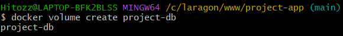
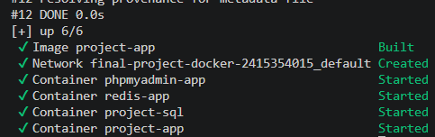
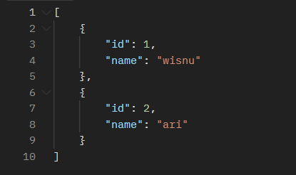
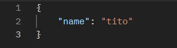
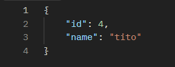
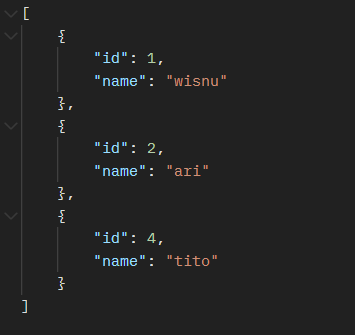

# final-project-docker-2415354015

# Laporan Hasil Praktikum: Final Project Aplikasi Berbasis Container

## Identitas Mahasiswa

- **Nama:** Putu Wisnu Putra Deasuryawan
- **NIM:** 2415354015
- **Kelas/Rombel:** TRPL C
- **Tanggal Praktikum:** 20 Mei 2026

---

## Teknologi & Tools yang Digunakan

- **Sistem Operasi:** Windows 10
- **Containerization:** Docker
- **Bahasa Pemrograman / Framework:** Node.js Express
- **Tools Lain:** VS Code, Git, Postman

---

## Langkah-Langkah Praktikum & Dokumentasi

### Langkah 1: Membuat Volume

Membuat Volume yang akan di gunakan untuk container MYSQL

```bash
docker volume create project-db
```

**Dokumentasi/Screenshot:**


---

### Langkah 2: Docker Compose

Meng-compose project sesuai dengan file 'docker-compose.yml', yang kemudian Docker akan secara otomatis membuat container dengan volume dan membuat network. 

```bash
docker compose up -d --build
```

**Dokumentasi/Screenshot:**


---

### Langkah 3: Pengujian Endpoint

Menguji ke-4 endpoint (GET, POST, PUT, DELETE) dengan menggunakan Postman


**ENPOINT 1, GET:**
Endpoint : /users


---

**ENPOINT 2, POST:**
Endpoint : /users




---

**ENPOINT 2, PUT:**
Endpoint : /users


---

## Kesimpulan

Tuliskan kesimpulan singkat atau kendala yang Anda hadapi beserta solusinya selama melakukan praktikum ini di sini.
